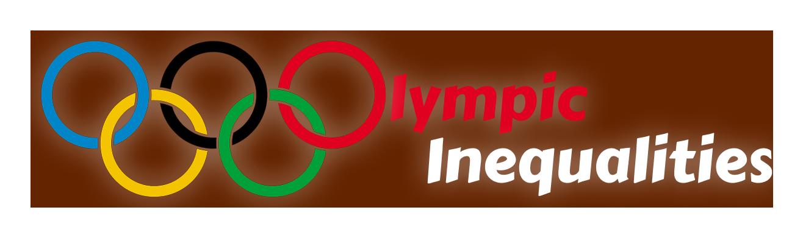

# Olympic Inequalities 

<p align="center">
  </img>
</p>

Project created in the context of EPFL COM-480 Data visualisation course in 2026.

Have a look at our [website](https://com-480-data-visualization.github.io/DataRizz/).


## Motivation

The Olympic Games are often seen as a symbol of fairness: athletes from all around the world competing on equal ground. But are the Olympics really as equal as they appear?

Our project explores how sociocultural, economic, and geopolitical contexts have shaped Olympic participation and success over time. Through a series of interactive visualizations, we investigate how wealth, population, gender representation, politics, and historical events influence the Games.

By combining storytelling with interactive data visualizations, our website reveals the inequalities hidden behind medal counts and athelete participation.

We explore the following themes:
- **Gender Representation**  
  The evolution of men's and women’s participation across Olympic history.

- **Medal Distribution**  
  How medals are distributed across continents, countries, sports, and disciplines.

- **Athlete Body Types**  
  Exploring physical characteristics associated with different sports and disciplines.

- **Geopolitical Contexts**  
  Wars, boycotts, and political tensions that shaped participation in the Games.

- **Economic Fairness**  
  Comparing medal counts while accounting for GDP and population differences.


## Target Audience
This website is accessible for everybody interested in how inequalities are reflected through the Olympics.  
Try out our visualisations and have fun on the website !


## Screen cast

Have a look at ou [screencast](https://youtu.be/ow9zDZU0r-M) to have an idea of what you can expect from our website.


## Dataset
We combined many datasets from Kaggle:
- [athlete_events.csv](https://www.kaggle.com/datasets/heesoo37/120-years-of-olympic-history-athletes-and-results?select=athlete_events.csv)
- [noc_regions.csv](https://www.kaggle.com/datasets/heesoo37/120-years-of-olympic-history-athletes-and-results?select=noc_regions.csv)
- [gdp_per_capita.csv](https://data.worldbank.org/indicator/NY.GDP.PCAP.CD)
- [pop_count.csv](https://www.kaggle.com/datasets/aliaamiri/historical-worldwide-countries-population)
- [conflicts.csv](https://www.kaggle.com/datasets/nikolaosroufas/history-of-large-conflicts-between-1800-2024)

We first [merged](milestones/milestone1/merge_datasets.ipynb) them into a single [olympic.csv](milestones/milestone3/olympics.csv) file. We then [created individual](milestones/milestone3/extract_viz_data.ipynb) extracted datasets per visualisation topic (see `website/data` folder) to make our website run smoother.


## Project Structure

```text
├── data/                 # Datasets and data processing files
├── milestones/           # Milestone submissions
└── website/              # Website source files
    ├── data/             # Processed data files
    ├── img/              # Images and icons
    ├── js/               # JavaScript files for the interactive visualisations
    └── models/           # 3D athlete models
```

## Running the Project Locally

To clone the repository:
```bash
git clone https://github.com/com-480-data-visualization/DataRizz.git
```
To run the website locally:
```bash
cd DataRizz/website
python -m http.server 8080
```

## Authors

| Student's name | SCIPER |
| -------------- | ------ |
| France Lu      | 345769 |
| Laura Taghizad | 346469 |
| Hana Salvetova | 339644 |


## Milestones

- [Milestone 1 report](milestones/milestone1/Milestone1.md).  
- [Milestone 2 report](milestones/milestone2/Report_M2.pdf).  
- [Final process book](milestones/milestone3/ProcessBook.pdf).
