# Milestone 1 (20th March, 5pm)

## Dataset
<!-- 1787 characters -->

Our project combines several publicly available datasets to build a unified dataset for analysis and visualisation. The main dataset comes from the [120 years of Olympic history: athletes and results](https://www.kaggle.com/datasets/heesoo37/120-years-of-olympic-history-athletes-and-results?select=athlete_events.csv) dataset on Kaggle, covering Olympic events from 1896 to 2016. It contains athlete-level information such as name, gender, age, sport, event, and medal results, as well as National Olympic Committee (NOC) codes mapped to country names. To add socioeconomic context, the World Bank dataset [GDP per capita (current US$)](https://data.worldbank.org/indicator/NY.GDP.PCAP.CD) (`gdp_per_capita.csv`) and the Kaggle dataset [Population by country (1960–2020)](https://www.kaggle.com/datasets/aliaamiri/historical-worldwide-countries-population) (`pop_count.csv`) were included. These allow analysis of the relationship between economic development, population size, and Olympic participation or performance. A dataset on the [history of large international conflicts](https://www.kaggle.com/datasets/nikolaosroufas/history-of-large-conflicts-between-1800-2024) (`conflicts.csv`) was also included, containing conflict names, participating countries, time periods, and contextual information. The final dataset (`olympics.csv`) is organised alphabetically by athletes, and individual names may appear multiple times if they participated in different Olympic editions or competed in multiple events.

Since the datasets come from different sources, several preprocessing steps were required. Column names were standardised and country names normalised to remove formatting differences. Few GDP data is missing before 1960, mainly due to changes in country names and geopolitical contexts over time (e.g. Yugoslavia, Czechoslovakia and the USSR/Soviet Union). For the conflict dataset, countries listed as text were parsed and expanded so conflicts could be matched with Olympic records by country and year. A conflict is associated with an athlete when their country was involved in a conflict during the corresponding Olympic Games edition.

## Problematic
<!-- 1374 characters -->

Since their revival in 1896, the Olympic Games have mirrored global changes. 
The athletes who participate and win medals are influenced by sociocultural, economic, and geopolitical contexts. 
The recent 2026 Winter Olympics in Milan motivated us to study this subject. 
Winners such as the Brazilian [Lucas Pinheiro Braathen](https://www.olympics.com/en/milano-cortina-2026/news/lucas-pinheiro-braathen-wins-giant-slalom-gold-brazil-s-first-ever-winter-olympics-medal), who won gold in the giant slalom, led us to ask:
> **How have sociocultural, economic, and geopolitical contexts been reflected in the Olympics over time?**

To address this question, we will investigate the following topics in relation to the Olympics over time:
- inequalities in gender;
- inequalities in wealth and population (GDP);
- inequalities in disciplines (insertion, removal, and winners);
- the reflection of geopolitical conflicts.

Our website will be structured into several tabs:
- a global analysis of the aforementioned inequalities;
- visualisations of statistics per country;
- visualisations of statistics per discipline;
- geopolitical conflicts reflected through the Games;
- surprising facts and winners.

Our project is intended for people who are interested in Olympic statistics. 
It is also aimed at those who are eager to discover surprising facts and winners of the Games. 
Additionally, it is designed for those interested in how the sociocultural, economic, and geopolitical contexts are reflected in participation and medals.

## Exploratory Data Analysis

Our [eda.ipynb](eda.ipynb) notebook demonstrates exploratory analysis of our dataset. We provide it's structure and some of the plots here, but more plots are available in the notebook.

#### 1 Dataset Preprocessing

Datasets were merged and cleaned in [merge_datasets.ipynb](merge_datasets.ipynb)

#### 2 Participation Analysis
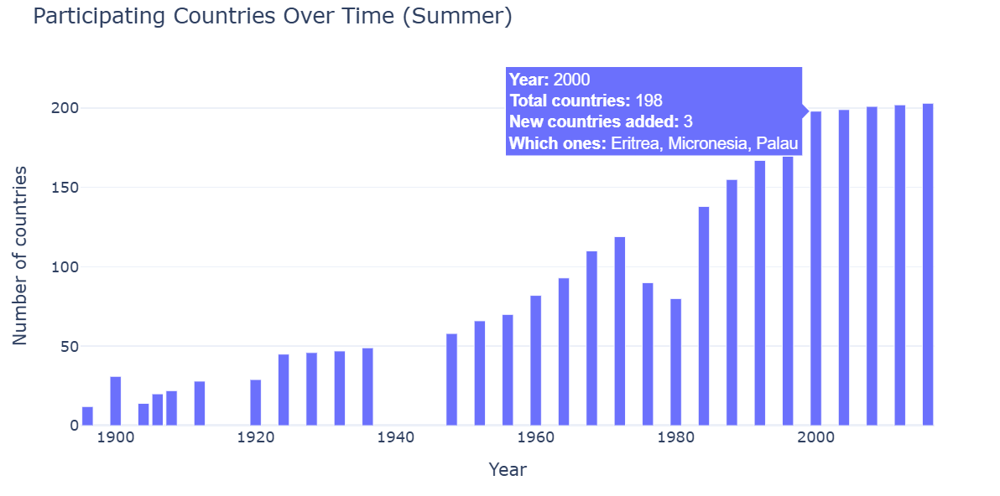
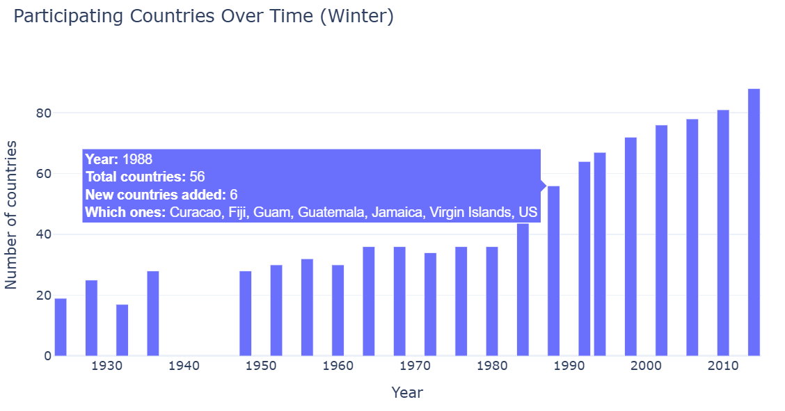

The decrease in participating countries in 1976 and 1980 is due to the [Montreal](https://www.olympics.com/ioc/news/diplomatic-controversies) and [Moscow](https://www.britannica.com/event/Moscow-1980-Olympic-Games) Olympic boycotts.

#### 3 Gender Representation
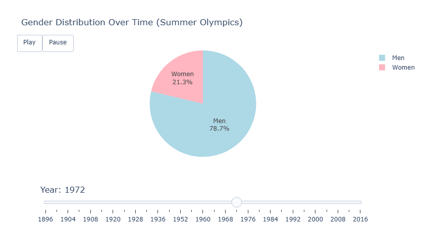
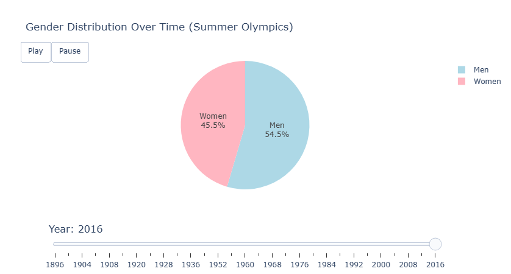

#### 4 Sports Distribution
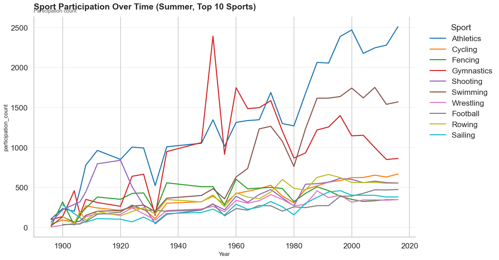
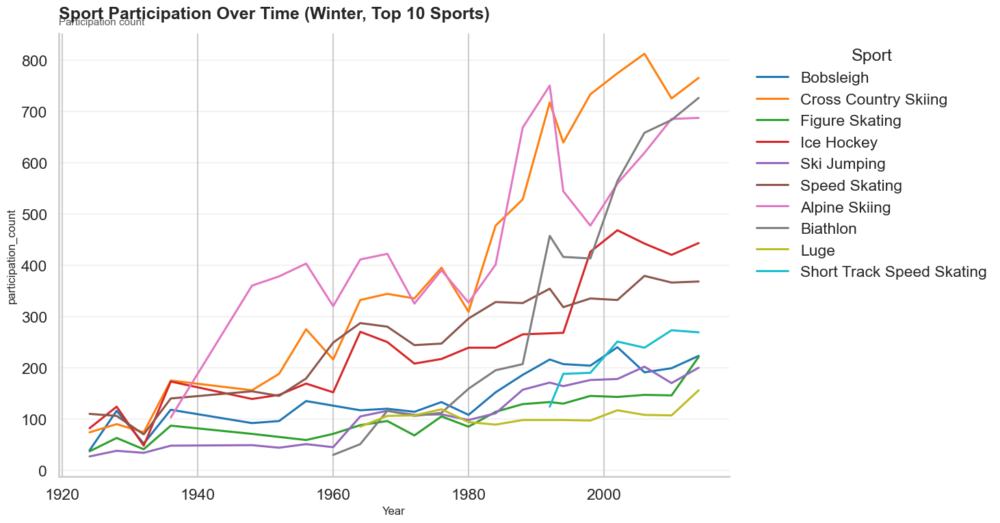

#### 5 Countries and Medals
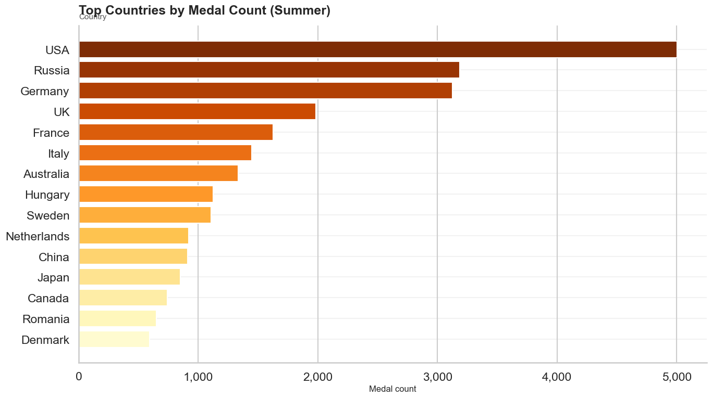
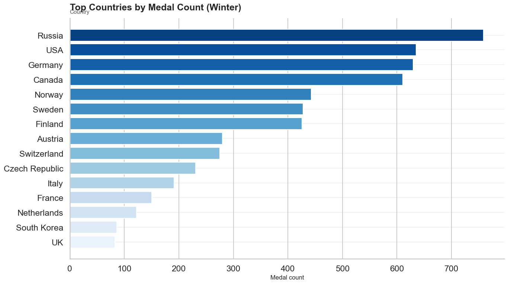

#### 6 Economic Inequality
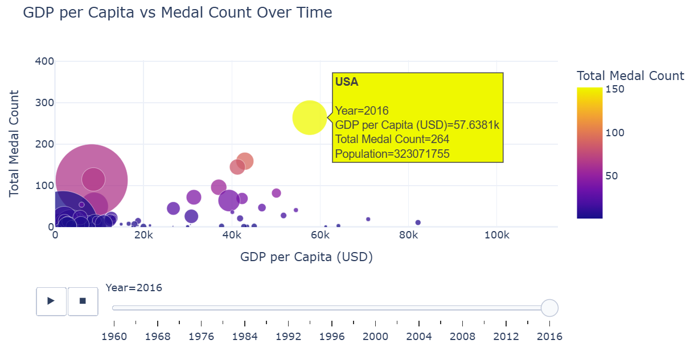

#### 7 Athlete Characteristics
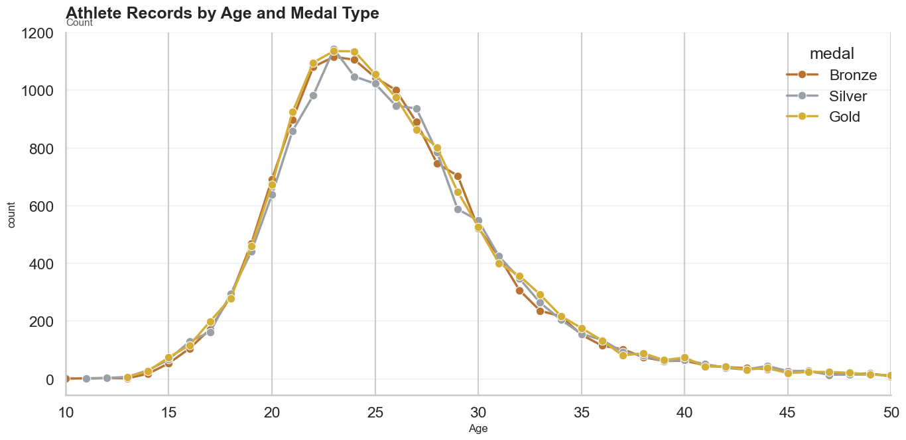

#### 8 Conflicts & Geopolitics
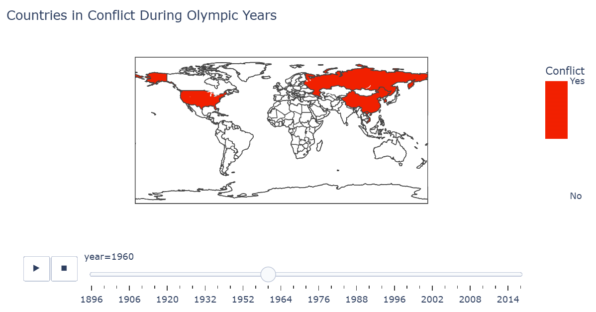

Between 1955 and 1975, during the Cold War, the United States intervened in Vietnam to contain the spread of communism, while North Vietnam was backed by China and the Soviet Union.

## Related work
<!-- 1879 characters -->

Several projects and visualisations have explored Olympic Games data in different ways. Here are a few examples:

- [120 Years of Olympic History - Summer Olympics & Weightlifting](https://public.tableau.com/app/profile/kia.prescott/viz/120YearsofOlympicHistory-SummerOlympicsWeightlifting/SummerOlympicGames): Many visualisations focus on Summer Olympics data. Across the different tabs, we can find gender performance comparisons and many visualisations dedicated to weightlifting.
- [120 Years of Olympic History: Athletes and Results](https://public.tableau.com/app/profile/fifi5043/viz/120YearsOfOlympicHistoryAthletesAndResults/Dashboard2): General interactive visualisations of the dataset at a global scale.
- [120 years of Olympics History Athletes and Results MS Excel Dashboard: Project Overview](https://github.com/Harshit0512/Harshit0512-120-years-of-Olympics-History-Athletes-and-Results---MS-Excel-Dashboard): A GitHub project providing a general analysis and some visualisations of the dataset.
- [120 years of Olympic Games | Towards Data Science](https://towardsdatascience.com/120-years-of-olympic-games-56411bc4bd53/): An article providing a dashboard-style analysis of the dataset.

These projects, as well as other existing works, propose general visualisations of the Olympic dataset, such as the evolution of sports, events, athlete participation, and medal distribution across countries. While these projects are informative, they typically focus on overall patterns or a single aspect of the data. In contrast, our approach differs by combining the Olympic dataset with additional datasets, allowing us to enrich the data and explore various types of inequalities at a global scale.

Our visualisations aim to be dynamic and interactive while guiding the user through the website. By combining parameters such as gender, GDP per capita, population, discipline trends, and historical conflicts, we build a narrative that shows how sociocultural, economic, and geopolitical contexts are reflected in Olympic participation and medal outcomes. While studies of Olympic performance are not entirely new, our approach differentiates itself by providing a multi-perspective, exploratory, and interactive experience that allows users to uncover surprising patterns and insights relating to inequalities.

